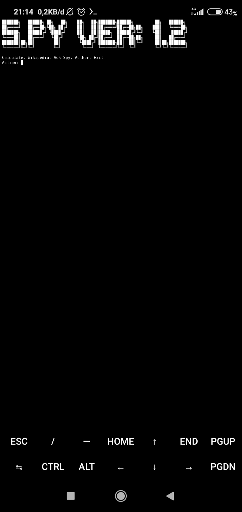
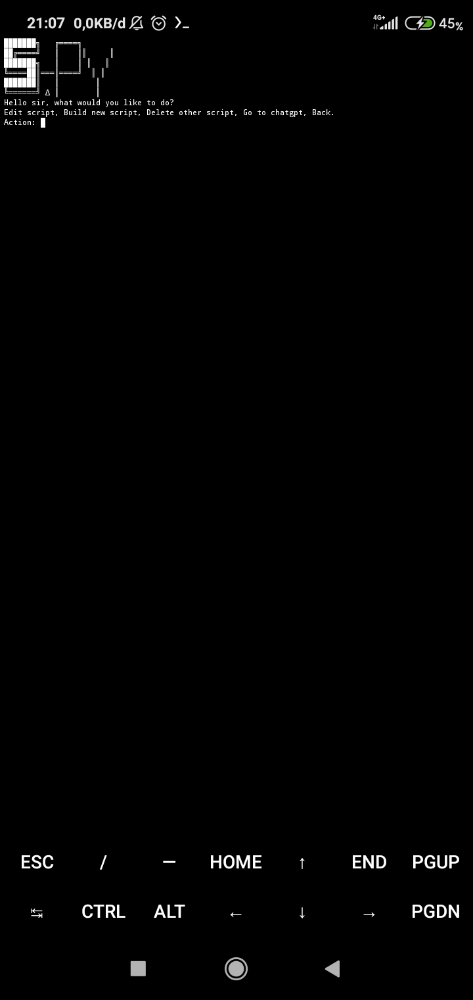

[](http://www.python.org/download/)
# Spy-Assistant
A template for python Virtual-Assistant.
# Screenshot 




# How to Install 
```bash
pkg install git
```

```bash
git clone https://github.com/RougeLoop/Spy-Assistant
```

```bash
pkg install python
```

```bash
cd Spy_Virtual-Assistant
```
```bash
python install.py
```
```bash
python s.py
```
# Conclusion
You are free to edit the python

# Thanks to
@x0 for the font
